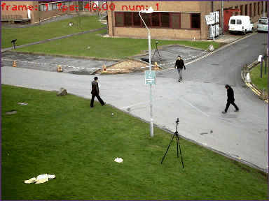

# 高空抛物算法

本算法主要作为高空抛物算法进行使用。

算法使用KNN算法对画面中的动态目标进行提取，然后使用ByteTrack算法对目标进行追踪。该算法的优势是可以在CPU端进行运行，在边缘侧可以达到实时追踪的效果，另外，由于高空抛物等场景中，出现什么物体并不能确定，因此直接套用detection算法并不合适，动态目标检测算法反而更适合该场景，而对任意目标的追踪又成为了一个问题，传统方法不如深度学习可靠，而基于模型的深度学习方法又比较慢，因此选择了新的ByteTrack来做追踪。但缺点也很明显，首先，由于采用KNN算法进行动态目标检测，对于不动的目标和大目标框不准确；其次，由于失去了目标检测中置信度这一项，导致ByteTrack算法退化。

## Algorithm

1. KNN（代码中也包含了gmm和帧间差算法，其中帧间差算法仍有问题，可进行自行调试）

2. ByteTrack算法，其中ByteTrack参考了官方的代码，并从中进行了剥离，该ByteTrack算法不需要模型支撑，仅需要CPU

## Experiments

我们使用了经典的追踪实验视频进行了实验，实验示意图如下图所示。我们发现相较于传统的追踪算法（不使用任何深度学习）无论是精度还是速度上都是比较好的，能够适用于要求不是很高的终端侧使用。

此外，我们也对汽车等一些未知物体进行了试验，发现仍具有较好的追踪效果，进行一定修改后可以作为高空抛物检测的算法应用。

## Acknowledge

虽然该算法并不复杂，但如果该算法对您有用，甚至有幸能够成为您研究、项目的一部分，请注明算法来源，不胜感激。
